# Manuals, Firmware and Special Notes for CSL CS710S Handheld Reader

[Product Information (Official Website)](https://www.convergence.com.hk/cs710s/)

## 1. Introduction

The CS710S RFID Sled Handheld Reader is a UHF EPC Class 1 Gen 2 RFID and barcode reader designed for use with mobile devices and PCs via Bluetooth 5.x or USB-C.

<p align="center">
  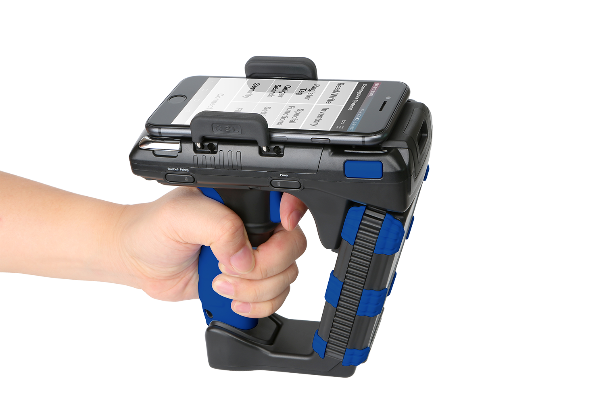
</p>

---

## 2. Unpacking

Verify the following items are included:

- CS710S RFID Reader  
- CS108B 3400 mAh Battery  
- USB-C to USB-C Cable  

---

## 3. Installing the Battery

1. Rotate both silver latches on the rear cover.
2. Slide the cover backward.
3. Insert the battery (front teeth first, contacts aligned).
4. Ensure the battery locks under the blue latch.
5. Reinstall the cover and lock both latches.

<p align="center">
  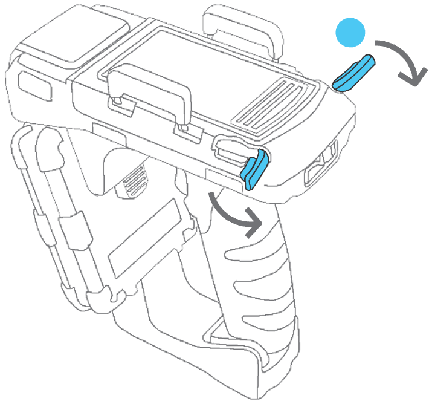
  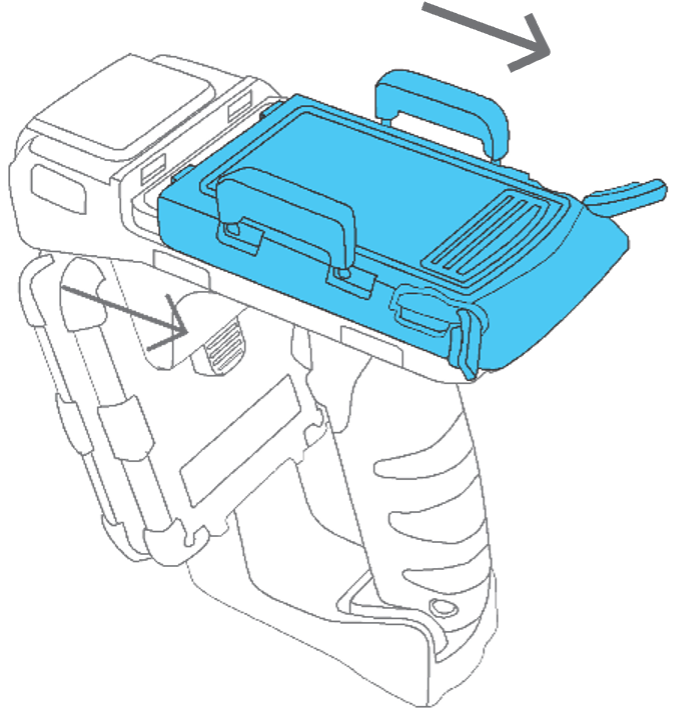
  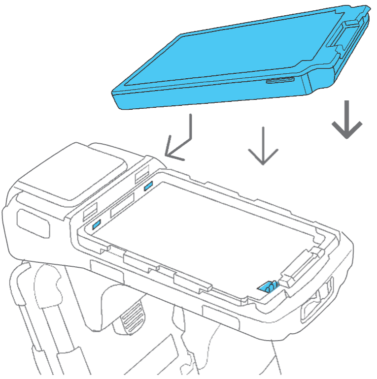
</p>
<p align="center">
  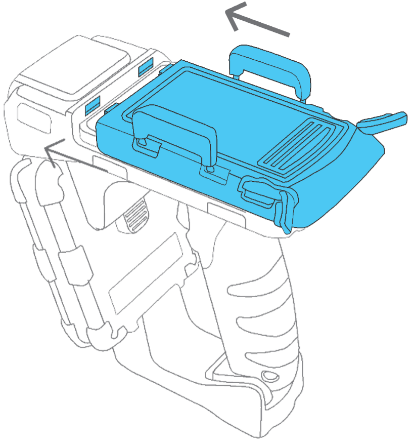
  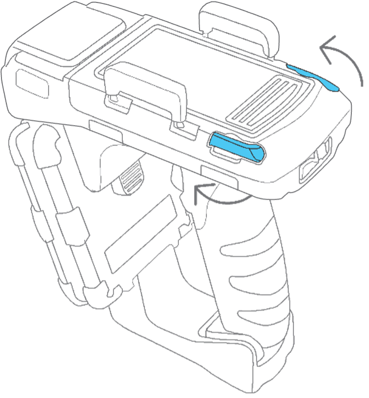
</p>

---

## 4. Firmware Upgrade

Please upgrade to the latest firmware that can be downloaded from GitHub.

### Required Downloads

- [Firmware Upgrade Tool](https://github.com/cslrfid/CS710S-Product-Downloads/tree/main/Firmware/Upgrade%20Tool)
- [Latest Atmel Firmware](https://github.com/cslrfid/CS710S-Product-Downloads/tree/main/Firmware/Firmware%20-%20Atmel)
- [Latest Bluetooth Firmware](https://github.com/cslrfid/CS710S-Product-Downloads/tree/main/Firmware/Firmware%20-%20Bluetooth)
- [Latest RFID Firmware (v2.0 or above)](https://github.com/cslrfid/CS710S-Product-Downloads/tree/main/Firmware/Firmware%20-%20RFID/For%20Readers%20with%20RFID%20firmware%20V2.0%20or%20Above)

### Post-Upgrade Configuration

After upgrading, open the **CS710S PC Demo App** and ensure the device name is **10 characters or shorter**. If it is longer, rename it to a shorter name.

<p align="center">
  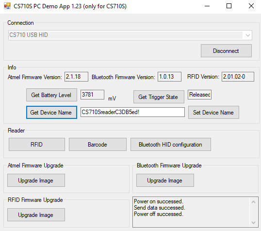
</p>

Click on the **Bluetooth HID configuration** button, then click on **Reset Factory**.

<p align="center">
  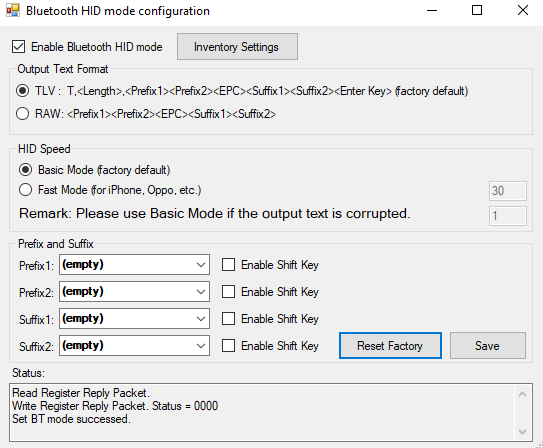
</p>

---

## 5. Powering On the Reader

1. Press and hold the **Power** button for **3 seconds**, then release.
2. The **Green LED** indicates power ON.
3. The **Blue LED** blinking indicates Bluetooth discoverable.

<p align="center">
  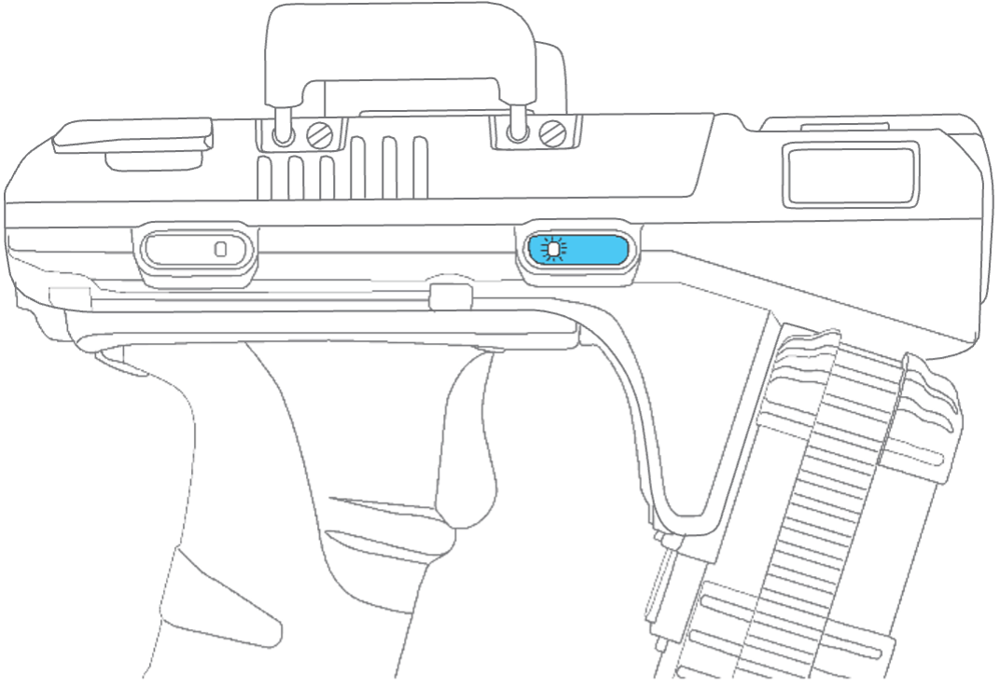
</p>

---

## 6. Bluetooth Connection Modes

The CS710S supports **two Bluetooth operating modes**.

### Normal Mode (BLE)
- High-speed BLE GATT communication
- Requires CSL demo app or custom SDK software
- Recommended for RFID inventory and advanced features

### HID Mode (Keyboard Emulation)
- Appears as a Bluetooth keyboard
- No application required
- RFID data is sent as keystrokes
- Lower tag throughput

<br>

| Bluetooth LED Pattern | Mode        |
|----------------------|-------------|
| Slow blink (1 / 2 s) | Normal Mode |
| Fast blink (3 / s)   | HID Mode    |

---

## 7. Switching Between Bluetooth Modes

Double-click the **Bluetooth button** to toggle between Normal Mode and HID Mode.


```text
      +------------------------+
      |   CS710S Powered On    |
      +-----------+------------+
                  |
                  v
  +-------------------------------+
  |  Double-click Bluetooth Btn   |
  +---------------+---------------+
                  |
         +--------+--------+
         |                 |
         v                 v
    Normal Mode       HID Mode
   (Slow Blink)     (Fast Blink)
     BLE GATT       Keyboard HID
```

---

## 8. Bluetooth Pairing

### Normal Mode Pairing

Pairing is performed **inside the application**, not via OS Bluetooth settings.

```text
  CS710S (ON, Slow Blink)
            |
            v
  CSL App → Scan / Connect
            |
            v
      Connected (BLE)
```

<p align="center">
  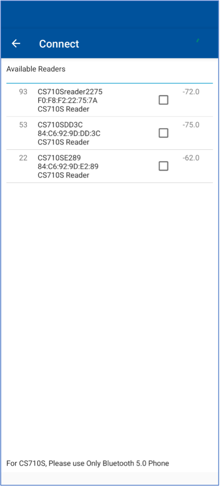
</p>

---

### HID Mode Pairing

Pairing is performed through **OS Bluetooth settings**.

```text
  CS710S (ON, Fast Blink)
            |
            v
   OS Bluetooth Settings
            |
            v
    Paired as Keyboard
```

<p align="center">
  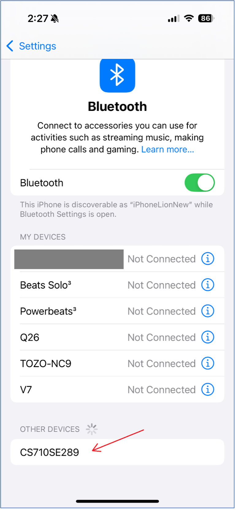
</p>

---

## 9. Downloading Applications

- **iOS**: Apple App Store → *CS710S RFID Reader*
- **Android**: Google Play → *CS710S*
- **PC / Linux**: https://www.convergence.com.hk → Downloads & Support → CS710S

---

## 10. Next Steps

- Perform RFID or barcode inventory using CSL demo apps
- Use HID Mode for legacy keyboard-based workflows
- Download SDKs and source code:
  - https://github.com/cslrfid
  - https://cslrfid.github.io/

---

### Notes

- Bluetooth 5.x hosts are recommended
- Battery level is accurate only when USB is disconnected
- USB-C tethered mode is ideal for PC configuration
